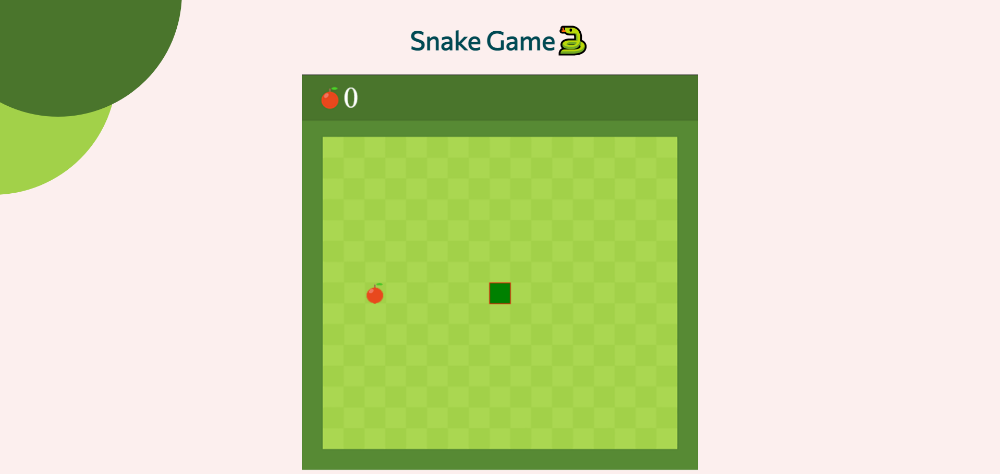

# Snake Game

Welcome to the Snake Game repository! This project showcases a classic Snake game implemented using HTML, CSS, and JavaScript. The game is a recreation of the well-known retro game where players control a snake to eat food and grow longer while avoiding collisions with the walls and the snake's own body.




## Demo

Check out the live demo of the Snake Game: [Demo Link](https://snake-game-ad1tya.netlify.app)

## Features

- Classic Snake gameplay experience.
- Score tracking as the snake eats food and grows longer.
- Game over detection upon collisions with walls or the snake's body.

## How to Play

1. Open the game in a web browser.
2. Control the snake's direction using arrow keys (up, down, left, right).
3. Guide the snake to eat the food to grow longer and increase your score.
4. Avoid colliding with the walls or the snake's own body to stay in the game.

## Prerequisites

- Web browser that supports HTML5 and JavaScript.

## Installation

1. Clone the repository:

```bash
git clone https://github.com/ad1tyaSharma/Snake_Game.git
cd Snake_Game
```
Open the `index.html` file in a web browser.

## Controls
Use the arrow keys (up, down, left, right) to control the snake's direction.

## Contributing
Contributions are welcome! If you find any issues or want to enhance the game, feel free to open a pull request. Make sure to follow the existing coding style and add appropriate improvements to the gameplay or design.
1. Fork the repository.
2. Create a new branch.
3. Make your changes and commit them.
4. Push the changes to your fork.
5. Open a pull request explaining your changes.<br/>
Feel free to reach out to the project owner at adihgr18@gmail.com with any questions or feedback!
